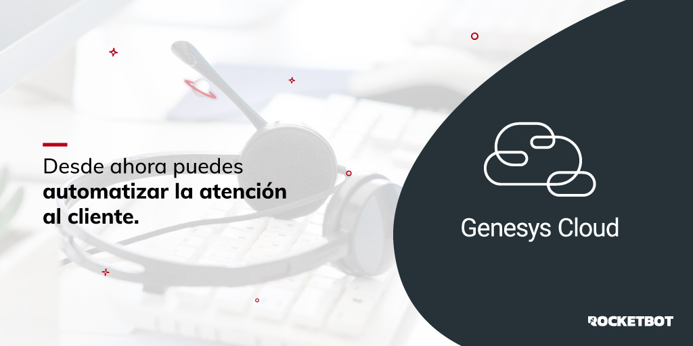

# genesysCloud
  
Módulo para trabajar con las funcionalidades de Genesys Cloud  

*Read this in other languages: [English](Manual_genesysCloud.md), [Español](Manual_genesysCloud.es.md).*
  

## Como instalar este módulo
  
__Descarga__ e __instala__ el contenido en la carpeta 'modules' en la ruta de Rocketbot.  

## Descripción de los comandos

### Establecer credenciales
  
Establece las credenciales para tener disponible la API
|Parámetros|Descripción|ejemplo|
| --- | --- | --- |
|client_id|client_id de la API de genesysCloud|Your client_id|
|client_secret|client_secret de la API de genesysCloud|Your client_secret|
|redirect_uri|redirect_uri de genesysCloud|htpps://localhost:5000/|
|auth code|auth code de genesysCloud|auth_code|

### Obtener todas las chats
  
Obtiene todas las conversaciones
|Parámetros|Descripción|ejemplo|
| --- | --- | --- |
|Resultado|Variable donde se almacenará el resultado|result|

### Obtener todas las llamadas
  
Obtiene todas las llamadas
|Parámetros|Descripción|ejemplo|
| --- | --- | --- |
|Resultado|Variable donde se guardará el resultado|result|

### Obtener chat por ID
  
Obtiene los detalles de una conversacion por ID
|Parámetros|Descripción|ejemplo|
| --- | --- | --- |
|ID|ID de la conversacion|id|
|Resultado|Variable donde se guardara el resultado|result|

### Obtener llamadas por ID
  
Obtiene los detalles de una llamadas por ID
|Parámetros|Descripción|ejemplo|
| --- | --- | --- |
|ID|ID de la llamada|id|
|Resultado|Variable donde se guardará el resultado|result|

### Historial de llamadas
  
Obtiene todas las llamadas del historial
|Parámetros|Descripción|ejemplo|
| --- | --- | --- |
|Resultado|Nombre de la variable donde almacenará el resultado|result|
