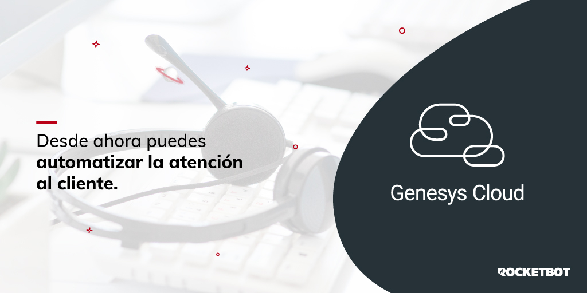

# genesysCloud
  
Module to work with Genesys Cloud functionalities  

*Read this in other languages: [English](Manual_genesysCloud.md), [Español](Manual_genesysCloud.es.md).*
  

## How to install this module
  
__Download__ and __install__ the content in 'modules' folder in Rocketbot path  

## Description of the commands

### Set credentials
  
Set credentials to make available the API
|Parameters|Description|example|
| --- | --- | --- |
|client_id|client_id of the genesysCloud API|Your client_id|
|client_secret|client_secret of the genesysCloud API|Your client_secret|
|redirect_uri|redirect_uri of genesysCloud |htpps://localhost:5000/|
|auth code|auth code of genesysCloud|auth_code|

### Get all active chats
  
Get all conversations
|Parameters|Description|example|
| --- | --- | --- |
|Result|Variable where the result will be stored|result|

### Get all active calls
  
Get all calls
|Parameters|Description|example|
| --- | --- | --- |
|Result|Variable where the result will be saved|result|

### Get chat by ID
  
Get conversation by ID
|Parameters|Description|example|
| --- | --- | --- |
|ID|Conversation ID|id|
|Result|Variable where the result will be saved|result|

### Get call by ID
  
Get call by ID
|Parameters|Description|example|
| --- | --- | --- |
|ID|Call ID|id|
|Result|Variable where the result will be saved|result|

### Call History
  
Get all calls in history
|Parameters|Description|example|
| --- | --- | --- |
|Result|Variable to store the result|result|
